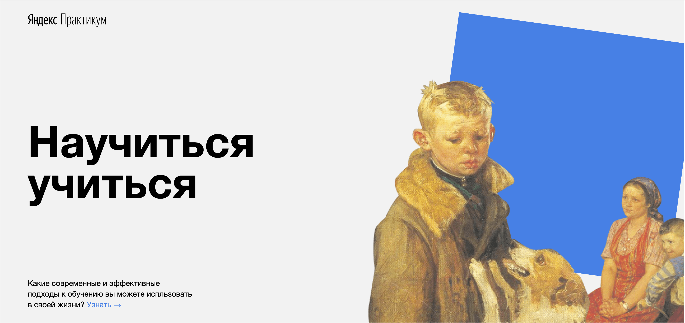

# Проект "Научиться учиться"
Ссылка на проект - https://bichurines.github.io/how-to-learn/

## Описание проекта
Сайт посвящен современным подходам и методикам обучения. Разобраны основные концепции, а также есть ссылке на дополнительные материалы.

Разметка статическая, так как данный проект является первым размещенным мною на GitHub.

Основной фокус в проекте на семантическую разметку и соблюдения методики БЭМ.

### Используемые технологии:
* __HTML5__
  * Семантические тэги
  * iframe из инструментом YouTube Player API
* __CSS__
  * Построение сеток с помощью flex и grid
  * Анимация фоновых объектов и ссылок при наведении
  * Позиционирование сложных элементов
* __БЭМ__
  * Все классы названы в соответствии с БЭМ
  * Создана файловая структура по модели nested, все блоки разбиты по отдельным папкам, элементы и модификаторы находятся в папках блоков по собственным разделам

## Планы по доработке

* Добавить адаптивность
